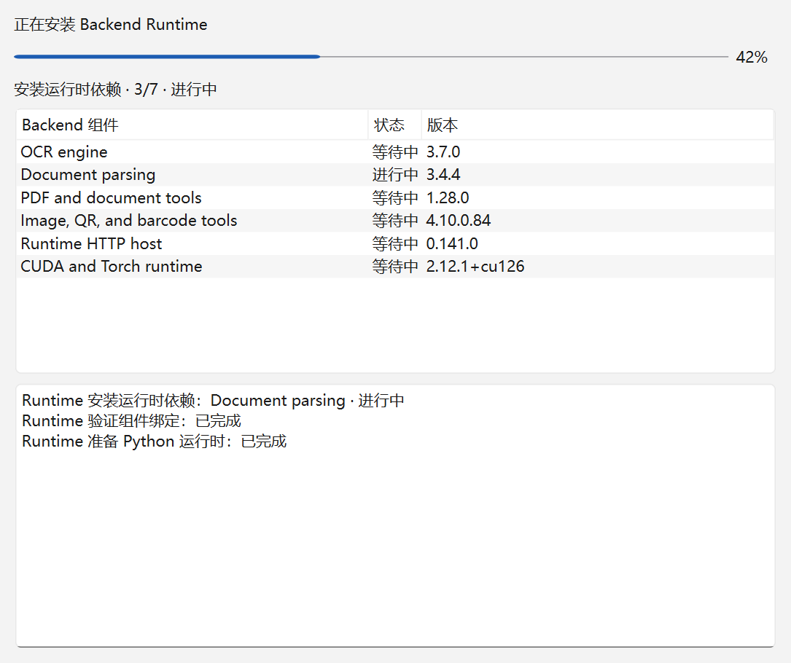
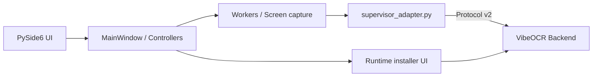

<div align="center">

# VibeOCR Classic

**面向 Windows 的 PySide6 桌面 OCR 客户端**

[](https://github.com/FelixJI/vibeocr-classic/actions/workflows/ci.yml)
[](https://github.com/FelixJI/vibeocr-classic/releases/latest)
[](apps/vibeocr-pyside/pyproject.toml)
[](.ci/project.json)
[](LICENSE)

[下载](#下载与使用) · [功能](#主要能力) · [架构](#架构) · [源码导读](docs/source-reading-guide.md) · [贡献](CONTRIBUTING.md)

</div>

VibeOCR Classic 是 VibeOCR 的 PySide6 桌面外壳，提供截图识别、图片/文档工作流与运行时安装体验。
OCR/PDF 推理由独立的 VibeOCR Backend 进程执行，Classic 通过绑定的 Protocol client 与它通信。



> [!IMPORTANT]
> Classic 仅支持 Windows 10/11 x64。Release 会绑定经过验证的 Backend 与 Protocol 组件；不要用邻仓
> editable/path dependency 替代正式组件边界。

## 主要能力

- 区域截图与图片 OCR；
- 文档/PDF 识别工作流；
- 本地 Backend 运行时的解析、安装、启动与状态展示；
- 通过 Protocol v2 提交 job、观察进度与取消；
- PySide6 原生桌面交互，数据与推理保留在本机。

## 下载与使用

1. 从 [Releases](https://github.com/FelixJI/vibeocr-classic/releases/latest) 下载
   `VibeOCRClassic-v<version>-win-x64.zip`。
2. 解压整个目录后运行根目录的 `VibeOCR.exe`；不要只复制 `current` 子目录。
3. 应用数据固定保存在解压根的 `state`，移动目录后继续复用；应用更新由内置更新器完成。

### 运行环境与组件安装

- 应用随包提供快速 OCR 等基础能力；首次需要相关能力时，应用会按组件锁解析并安装本地运行时。
- 在设置的“推理后端”选择基础 Runtime、GPU 加速或 CPU 模式，在“可选识别能力”勾选
  “PaddleOCR 引擎”“MinerU 文档解析”或“GPU 运行时”。这些选择只表达安装意图：点击
  “切换并安装…”或“安装所选能力…”后会先展示 Backend 给出的安装计划，包括目标推理设备、
  各项保留/安装/替换/移除及原因、依赖包来源、预计下载量、新增磁盘占用和阻碍项；核对后点
  “确认并安装”才会停止当前服务并执行。
- 推理设备只是安装目标偏好：选择 GPU 不代表高级引擎或模型已经安装或可用，基础能力不受影响。
- PaddleOCR 与 MinerU 可在支持范围内独立选择，实际会安装、保留或移除哪些依赖以安装计划为准。
  Paddle 与基础环境、MinerU 使用相互隔离的解释器，兼容的依赖工件会复用已验证的下载缓存；
  缓存复用不等于安装目录共享，也不承诺所有场景的磁盘占用都会减少。
- 预计下载量只计本次新增下载，不等于最终环境大小；依赖尚未解析时显示“尚未知”，下载总量
  未知时只展示阶段与已用时，不定百分比。全部字节下载完成后还需经过安装、验证与激活，
  下载进度到 100% 不等于整体完成。

### 模型准备与就绪状态

- 依赖安装、模型首次准备、引擎在所选设备上实际可用和服务就绪是不同的阶段。模型由
  PaddleOCR/MinerU 的原生机制在首次使用时准备，可能需要额外下载；安装成功或
  “运行环境已验证”不代表模型全部就绪。
- 模型按需加载；“Supervisor 已就绪”不代表所有模型已经提前载入内存。

### 失败、取消与恢复

- 失败或取消会保留本次已下载的内容。按界面给出的原因与可用动作处理：重新读取安装计划
  重试、用“修复运行环境”修复损坏组件，或在“下载设置”调整 Python 包索引或模型源后再试；
  修改来源或组件选择后需要重新预览确认，来源修改只影响下一次操作。
- 安装中断后应用会恢复此前可用的服务；旧服务恢复不代表本次安装已成功。
- 请不要手工执行 pip、删除运行时目录或下载缓存，也不要为安装问题更改显卡驱动。

## 架构



Classic 负责窗口、用户操作和 Backend 生命周期；`supervisor_adapter.py` 是桌面层与运行时协议之间的
关键 seam。推理实现不应复制到前端。

## 仓库地图

```text
apps/vibeocr-pyside/
├── pyproject.toml               # 应用包与 vibeocr CLI
└── src/vibeocr/classic/
    ├── main.py                  # QApplication 入口
    ├── views/main_window.py     # 主窗口与生命周期组合
    ├── pyside/supervisor_adapter.py # Backend/Protocol 边界
    └── widgets/                 # 截图等交互组件
tests/                           # UI、worker、adapter 与组件测试
scripts/
├── resolve_component_releases.py
├── install_resolved_components.py
├── build-release.ps1
└── automation.py
component-policy.json            # Backend/Protocol 组件选择策略
.ci/project.json                 # CI、资产与发布契约
```

新手建议先读 [源码阅读指南](docs/source-reading-guide.md)，沿“应用启动”和“截图识别”两条链理解职责边界。

## 从源码开发

需要 Windows、[uv](https://docs.astral.sh/uv/) 与 Python 3.13。仓库的 CI bootstrap 会先解析最新正式
Backend 及其绑定的 Protocol，再安装到隔离的 release-input：

```powershell
git clone https://github.com/FelixJI/vibeocr-classic.git
cd vibeocr-classic
uv venv --seed .venv
$env:VIRTUAL_ENV = (Resolve-Path .venv).Path
$env:Path = "$env:VIRTUAL_ENV\Scripts;$env:Path"
uv run --no-sync python scripts/resolve_component_releases.py --policy component-policy.json --output-root build/automation/release-input
uv run --no-sync python scripts/install_resolved_components.py --release-input build/automation/release-input
uv run --no-sync python -m pytest
```

应用入口由 `apps/vibeocr-pyside/pyproject.toml` 声明为 `vibeocr.classic.main:main`。本地启动方式会随
组件安装布局调整，优先参考该 pyproject、项目脚本与 CI 输出。

## 验证与发布

纯 Python/UI 逻辑先运行相邻 pytest；涉及组件锁时再运行 release-input 验证。打包、frozen smoke 和正式
资产验证需要完整 Windows 环境，由 PR CI 执行。

正式资产包括：

- 用户下载的 Velopack Portable，以及供内置更新器使用的 full、相邻版本 delta nupkg 与 `releases.win.json`；
- Backend component lock 与前端 Protocol lock；
- build identity 与 SPDX SBOM。

精确命令和资产集合以 [`.ci/project.json`](.ci/project.json) 为准。

## 参与贡献

请先阅读 [`CONTRIBUTING.md`](CONTRIBUTING.md) 与 [源码阅读指南](docs/source-reading-guide.md)。UI 可见改动
需要在 PR 附截图；提交使用 Conventional Commit，并保留组件解析与 Protocol 边界。

## 许可证

本项目基于 [LICENSE](LICENSE) 中的条款发布。
