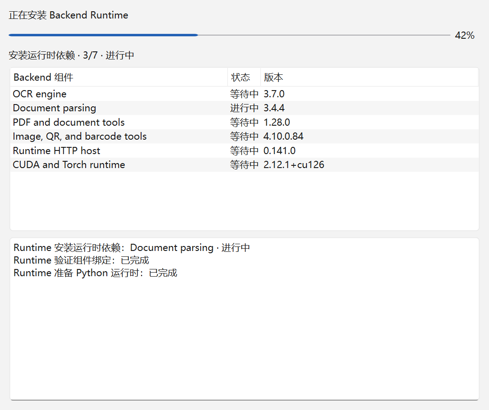
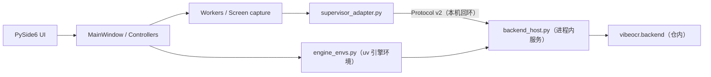

<div align="center">

# VibeOCR Classic

**面向 Windows 的 PySide6 桌面 OCR 客户端**

[](https://github.com/FelixJI/vibeocr-classic/actions/workflows/ci.yml)
[](https://github.com/FelixJI/vibeocr-classic/releases/latest)
[](apps/vibeocr-pyside/pyproject.toml)
[](.ci/project.json)
[](LICENSE)

[下载](#下载与使用) · [功能](#主要能力) · [架构](#架构) · [源码导读](docs/source-reading-guide.md) · [贡献](CONTRIBUTING.md)

</div>

VibeOCR Classic 是 VibeOCR 的 PySide6 桌面应用，提供截图识别、图片/文档工作流与识别引擎安装体验。
基础识别能力（快速 OCR）内置于主程序；PaddleOCR、MinerU 等高级识别引擎按需安装，由本机
[uv](https://docs.astral.sh/uv/) 管理独立运行环境。Classic 与 VibeOCR Next 是两个独立产品，
可以同时运行。

> 2026-10-08 起，原 `FelixJI/vibeocr-backend` 仓库（v0.15.1，`8969b48`）已整体并入本仓
> `apps/vibeocr-backend/`（保留完整提交历史），识别服务在应用进程内运行（Protocol v2
> 接口保持不变），不再从外部仓库解析、安装后端组件。



> [!IMPORTANT]
> Classic 仅支持 Windows 10/11 x64。Protocol SDK 以固定版本的 wheel 引入（见
> `apps/vibeocr-pyside/pyproject.toml`）；不要用其它来源的 SDK 替代。

## 主要能力

- 区域截图与图片 OCR（内置，开箱即用）；
- 文档/PDF 识别工作流；
- 高级识别引擎（PaddleOCR、MinerU，各分 CPU/GPU 版）在设置里按需安装、随时移除；
- 安装过程展示阶段与实时日志；
- PySide6 原生桌面交互，数据与推理保留在本机。

## 下载与使用

1. 从 [Releases](https://github.com/FelixJI/vibeocr-classic/releases/latest) 下载
   `VibeOCRClassic-v<version>-win-x64.zip`。
2. 解压整个目录后运行根目录的 `VibeOCR.exe`；不要只复制 `current` 子目录。
3. 应用数据固定保存在解压根的 `state`，移动目录后继续复用；应用更新由内置更新器完成。

从 v0.10.10–v0.11.0 升级到包含便携路径修复的版本时，需要一次性重新安装运行环境组件，
并按需重新准备模型。这些旧版本误将运行环境和 Backend 托管模型存入更新时替换的目录；
配置、识别输出和日志仍保留在解压根的 `state`。修复后的版本将运行环境存入稳定目录，
后续更新可继续复用；回退到上述旧版本则不能直接复用新位置的运行环境。

### 识别引擎的安装与选择

- 快速识别等基础能力已内置，无需安装任何东西，第一次启动即可使用。
- 需要更高精度或文档解析时，到「设置 → 可选识别能力」勾选 “PaddleOCR 引擎”或
  “MinerU 文档解析”，再按提示选择 CPU 或 GPU 版本（GPU 版需要 NVIDIA 显卡）。
- 点击“安装所选能力…”并确认后开始下载：安装窗口会显示当前阶段，并把下载与安装
  过程的日志逐行实时展示；下载量较大时请保持网络可用。
- 各引擎使用相互独立的运行环境（由 uv 创建并管理，存放在 `state/envs/`），互不影响；
  取消勾选并确认后即可移除对应环境，释放磁盘空间。
- 更换 CPU/GPU 版本会重新下载对应版本；安装期间识别服务会暂停，完成后自动恢复。
- 依赖与模型的下载来源可以在安装窗口或「设置 → 下载来源」里选择（依赖：国内镜像 / PyPI
  官方源；模型：HuggingFace / ModelScope），更改只影响之后的下载，引擎依赖带哈希校验，
  换源不改变安装内容。

### MinerU 远程连接

- 在「设置 → 识别设置 → MinerU 连接」可选择本地或远程 MinerU。远程模式连接自部署
  MinerU 4 服务的 HTTP API（/v1 完整解析）；不适用于 MinerU 云端套餐或 OpenAI 兼容
  推理接口。
- 远程模式由 Backend 调用远端服务，无需本地 MinerU 组件、模型或 GPU，也不会启动本地
  MinerU 进程；本地模式仍使用本机安装的 MinerU，两者与 PaddleOCR 的独立选装互不影响。
- 服务根地址仅支持 http/https（可含反向代理路径），不允许携带用户名/密码、查询参数或
  锚点；API Key 为可选密码输入，仅保存在 Backend 设置中，不会回显到界面或写入日志。
  已保存的 Key 在输入留空时自动保留，仅修改地址不会丢失；需要删除时使用显式清除。
- 保存只写入配置并回读确认，不代表远程服务可用；新配置需点击「验证并准备远程服务」
  由 Backend 真实验证并准备后才能提交解析任务。“模型与性能”页的本地驻留 TTL 与释放
  只作用于本地，不管理远程服务的资源。
- 远程连接要求 Backend 声明 `ocr.mineru-remote-api.v1` 能力；旧 Backend 会在设置页
  明确显示不可用，请升级到绑定新版 Backend 的产品版本。

### 模型准备与就绪状态

- 引擎安装、模型首次准备和服务就绪是不同的阶段。模型由 PaddleOCR/MinerU 的原生机制
  在首次使用时准备，可能需要额外下载；安装成功不代表模型全部就绪。
- 模型按需加载；“识别服务已就绪”不代表所有模型已经提前载入内存。

### 失败、取消与恢复

- 安装失败或取消会保留已下载的缓存，重试时通常无需重新下载全部内容；具体原因与
  进度见安装窗口的日志。
- 安装中断后应用会恢复此前可用的识别服务；服务恢复不代表本次安装已成功。
- 请不要手工修改 `state/envs/` 里的引擎环境或删除下载缓存，也不要为安装问题更改显卡驱动。

## 架构


```mermaid
flowchart LR
    User["PySide6 UI"] --> Window["MainWindow / Controllers"]
    Window --> Worker["Workers / Screen capture"]
    Worker --> Adapter["supervisor_adapter.py"]
    Adapter -->|"Protocol v2（本机回环）"| Host["backend_host.py（进程内服务）"]
    Host --> Backend["vibeocr.backend（仓内）"]
    Window --> Envs["engine_envs.py（uv 引擎环境）"]
    Envs --> Host
```

Classic 负责窗口、用户操作与识别服务生命周期；`supervisor_adapter.py` 是桌面层与
Protocol 之间的 seam，`backend_host.py` 是承载后端的唯一入口（前端其它模块不得
直接 import 后端包）。

## 仓库地图

```text
apps/vibeocr-pyside/
├── pyproject.toml               # 应用包与 vibeocr CLI（workspace 依赖后端）
└── src/vibeocr/classic/
    ├── main.py                  # QApplication 入口
    ├── backend_host.py          # 进程内后端宿主（uvicorn 线程）
    ├── engine_envs.py           # Paddle/MinerU 引擎环境（uv 管理）
    ├── views/main_window.py     # 主窗口与生命周期组合
    ├── pyside/supervisor_adapter.py # Protocol 边界
    └── widgets/                 # 截图等交互组件
apps/vibeocr-backend/            # 并入的 Backend 源码（含 packages/vibeocr-backend、
                                 #   tests、scripts、release，内部布局保持原样）
tests/                           # UI、worker、adapter 与融合形态测试
scripts/
├── generate_workspace_locks.py  # 发布身份锁生成
├── verify_inprocess_backend.py  # 进程内后端 e2e
├── build-release.ps1
└── automation.py
component-policy.json            # 协议兼容与能力声明
.ci/project.json                 # CI、资产与发布契约
```

新手建议先读 [源码阅读指南](docs/source-reading-guide.md)，沿“应用启动”和“截图识别”两条链理解职责边界。

## 从源码开发

需要 Windows、[uv](https://docs.astral.sh/uv/) 与 Python 3.13。仓库是一个 uv workspace，
一条命令即可装齐前端、仓内后端与基础识别依赖：

```powershell
git clone https://github.com/FelixJI/vibeocr-classic.git
cd vibeocr-classic
uv sync --project apps/vibeocr-pyside
uv run --no-sync --project apps/vibeocr-pyside python -m pytest
```

应用入口由 `apps/vibeocr-pyside/pyproject.toml` 声明为 `vibeocr.classic.main:main`。
设置 `VIBEOCR_SUPERVISOR_SUBPROCESS=1` 可临时回退旧的独立子进程形态进行对比调试。

## 验证与发布

纯 Python/UI 逻辑先运行相邻 pytest；涉及后端组装契约时运行
`scripts/verify_inprocess_backend.py`。打包、frozen smoke 和正式资产验证需要完整
Windows 环境，由 PR CI 执行。

正式资产包括：

- 用户下载的 Velopack Portable，以及供内置更新器使用的 full、相邻版本 delta nupkg 与 `releases.win.json`；
- 发布身份锁（component lock 与前端 Protocol lock）；
- build identity 与 SPDX SBOM。

精确命令和资产集合以 [`.ci/project.json`](.ci/project.json) 为准。

## 参与贡献

请先阅读 [`CONTRIBUTING.md`](CONTRIBUTING.md) 与 [源码阅读指南](docs/source-reading-guide.md)。UI 可见改动
需要在 PR 附截图；提交使用 Conventional Commit，并保留 Protocol 边界与进程内承载 seam。

## 许可证

本项目基于 [LICENSE](LICENSE) 中的条款发布。
