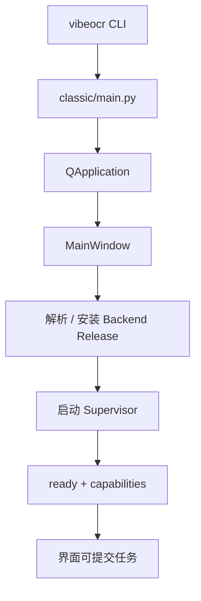
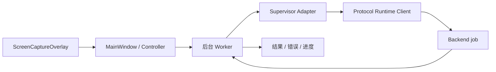

# VibeOCR Classic 源码阅读指南

这份指南面向第一次阅读 PySide6 桌面项目的贡献者。先把 Classic 看作“UI + 本地运行时生命周期”，
不要把 Backend 的模型实现想象成前端内部模块。

## 三个关键边界

1. `main.py` 与 `views/main_window.py` 负责应用、窗口和用户工作流。
2. `pyside/supervisor_adapter.py` 把桌面操作转换成 Protocol client 调用。
3. OCR/PDF 推理、job registry 与模型调度位于独立 Backend Release。

## 15 分钟启动链

按以下顺序阅读：

1. `apps/vibeocr-pyside/pyproject.toml`：确认 Python、依赖与 `vibeocr` entry point。
2. `apps/vibeocr-pyside/src/vibeocr/classic/main.py`：找到 QApplication 与 MainWindow 创建。
3. `views/main_window.py`：查看窗口如何连接 action、worker 与运行时状态。
4. `pyside/supervisor_adapter.py`：理解 Backend 进程与 Protocol client 如何隐藏在 seam 后。
5. 搜索 runtime installer、ready 和 shutdown，补全首次启动与退出流程。
6. 对照 pytest/pytest-qt 测试，确认信号、状态和错误路径。



阅读启动链时，区分“进程已启动”“Supervisor ready”“模型已按需加载”三个状态。

## 第一条功能链：截图识别

从 `widgets/screen_capture_overlay.py` 开始：

1. 查看用户如何选择屏幕区域，坐标与图像由谁持有。
2. 追踪截图结果如何回到 MainWindow/controller。
3. 找到后台 worker，确认编码、网络等待或文件处理不会阻塞 GUI 线程。
4. 进入 `pyside/supervisor_adapter.py`，查看请求怎样交给 typed Protocol client。
5. 找到 observe/progress/result 如何转换成 Qt signal 与 UI 状态。
6. 对照截图、worker 与 adapter 测试，特别关注取消、窗口关闭和运行时不可用。



## 第二条功能链：运行时安装进度

结合 `docs/runtime-install-progress.png` 阅读：

1. 从 UI 文案或 signal 名搜索安装进度组件。
2. 找到 component policy 与 release resolver 的调用边界。
3. 追踪下载、校验、安装阶段如何映射为可展示状态。
4. 查看失败、取消和重试是否由真实状态驱动，而不是 UI 猜测。
5. 对照 `scripts/resolve_component_releases.py`、`install_resolved_components.py` 与 CI component input tests。

组件 Release 的身份、资产与绑定 Protocol 是发布契约；UI 只展示并驱动这个流程，不重新定义它。

## PySide6 阅读技巧

- 先找 signal/slot 的连接位置，再分别阅读发送方与接收方。
- 识别 GUI thread 与 worker thread 的边界；不要在主线程执行长任务。
- QApplication fixture、窗口关闭和对象生命周期测试比单个 widget snapshot 更重要。
- 将 UI 状态与领域状态分开：按钮是否可用是表现，job/runtime 状态才是事实。

## 按方向深入

### UI 与交互

从 `views`、`widgets` 和相邻 pytest-qt 测试开始。可见变化需要截图，并验证缩放、关闭、取消等实际相关路径。

### Backend 连接

集中阅读 `pyside/supervisor_adapter.py` 与 runtime client。新增协议能力时先更新/发布 Protocol，再按 capability
消费；不要使用版本号分支猜行为。

### 组件安装

阅读 `component-policy.json`、resolve/install scripts 与组件测试。不要写本地绝对路径或 editable
dependency，也不要绕过资产 identity 和 SHA 校验。

### 打包

按 `.ci/project.json` → `scripts/automation.py` → `scripts/build-release.ps1` → CI workflow 阅读。只有涉及
hidden imports、资源、组件布局或打包入口时，才需要真实 frozen smoke。

## 最小验证

锁定开发环境并运行与你改动相邻的测试：

```powershell
uv venv --seed .venv
$env:VIRTUAL_ENV = (Resolve-Path .venv).Path
$env:Path = "$env:VIRTUAL_ENV\Scripts;$env:Path"
# 首次使用先按 README 解析并安装正式组件输入
uv run --no-sync python -m pytest <相关测试文件>
```

涉及组件输入时再执行 resolver/install 与 `verify_component_release_input.py`。PR CI 会完成完整 Windows
打包和 smoke；不要为了小改动在本地重复下载全部重型组件。

## 常见误区

- **把推理代码加进 Classic**：模型和 scheduler 属于 Backend。
- **在 GUI thread 等待 Backend**：耗时工作应走 worker/signal。
- **把 ready 当作模型加载完成**：二者是不同状态。
- **直接依赖邻仓源码**：Classic 消费绑定的正式 Backend/Protocol Release。
- **只测试按钮点击**：还要测试状态转换、取消、关闭和 adapter 错误。
- **任何改动都跑 frozen build**：先聚焦测试，只在打包边界相关时扩大验证。

## 读完后的自检

你应该能回答：

- QApplication、MainWindow 与 Supervisor 的生命周期如何连接？
- 截图数据怎样经过 worker 和 adapter 到 Backend？
- progress/result/error 如何安全回到 GUI thread？
- component policy、Backend Release 与 Protocol lock 的关系是什么？
- 哪些修改必须运行 frozen/package smoke？

能回答这些问题，就可以从一个 widget、worker 或 adapter 的小改动开始第一个 PR。
